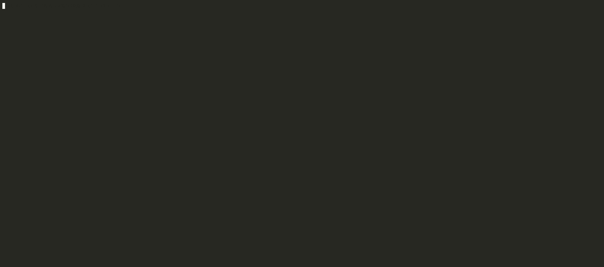

<div align="center">

</div>

<h3 align="center">Doggo</h3>
  <p align="center">
  Aleph Hack
        <br />
    <a href="">Docs</a>
    .
    <a href="">Live</a>
    ·
    <a href="">Youtube</a>
    ·
    <a href="https://github.com/bokovhu/doggo">Code</a>
  </p>
</div>

### Screenshots

* The app supports `--help`, which makes it completely _self-documenting_



* The Smart Contract stores ownership of cards, and one feature of the app is that it allows interacting with this contract


* The app also supports _minting_ new cards


* The app also supports _transferring_ (gifting) cards to other accounts


* The app supports the `--result-json` flag to output the result of a command in JSON format (which is useful for scripting)


### Summary

Doggo is a dogfighting simulation card game, where cards are NFTs on the blockchain.

* After you _become a member_, you can _obtain cards_ to play with them in various ways:
    * You can _mint cards_ for yourself; you have to pay the _minting fee_, after which you receive a brand-new _random generated card_, that is _unique in the world_.
    * You can ask other members to _gift you cards_; you have the right to _transfer_ any of your cards to _other members_.
    * You can _win cards_ from other members in _battles_; _challenge_ a member, place your _bet_, and _ask_ for cards in return. If you win the battle, your opponent's cards are yours, but if you loose, you loose your bet.
* You can _challenge_ other members, to play _battles_, and you can use _your own cards_ in these battles.
* There are _two types of cards_ ...
    * _Unit cards_ spawn various units to fight for you in the battle field. They may also contain _effects_, which are applied to _each spawned unit_.
    * _Effect cards_ contain one or more _effects_, which somehow affect the battle
* The game uses a _deterministic simulation_ to calculate the outcome of battles; the same _match seed_ results in the same _list of events_. Here's how the game works:
    * First, the _6 submitted cards_ of each player are shuffled into the _playing deck_.
    * Then the game is played in turns ...
    * First, the top card of the playing deck is drawn, and it is played instantly ...
        * If it is a _unit card_, the units on it are spawned (we check for each already played effects, and activate them as necessary)
        * If it is an _effect card_, the effect is played
    * Then, units without a target _find a new target_ (randomly)
    * Then, _units are shuffled_
    * Then, each unit _attacks their target_ ...
        * The damage is calculated using the _current stats_ of the units, and _random rolls_ for _attacking_ and _defending_
        * If the target is _killed_, the unit is _removed_ from the battlefield (we check for each already played effects, and activate them as necessary)
    * Then, the _next turn_ begins
    * If a player _runs out of units_, the other player wins
* The Smart Contract of the game makes sure, that _fair-play is applied_ ...
    * The _contract owner_ is a _single entity_ responsible for running the simulations, and recording the winners
    * When _recording the winner_ of a challenge, the _card transfer_ is immediately executed
    * Challenges may also contain a _token pot_ (in the native tokens), which is _transferred_ to the winner

### Quickstart

First, refer to the [Assembling the development environment](./packages/docs/02-Main/01-DevEnv.md) guide to get all the tools you need to play with the project.


To build & test the app locally, you need to do a following:

* Open a **new terminal**, and run the following command in it before anything else to install NPM dependencies

```bash
npm install
```

* In the _same terminal_, run the following command in it to start the _Substrate Contract Node_ in the background

```bash
npm run dev:contract-node
```

* Open a **new terminal**, and run the following command in it to build the app, and deploy it to the _local development environment_

```bash
npm run build:dev
```

* Then, in the _building terminal_, you can run the following command to get the final _binaries_, and install them locally for testing

```bash
npm run package && npm run install:linux
```

* Finally, you can run the following command to start the app

```bash
# To claim ownership of the new contract with Alice
doggo --suri //Alice claim-ownership
```

## Team

| Name          | Discord   | Telegram   | E-mail                        |
| :------------ | :-------- | :--------- | :---------------------------- |
| Frank Dierolf | frankbevr | @frankbevr | `frank_dierolf@web.de`        |
| Botond Kovacs | -         | -          | `botondjanoskovacs@gmail.com` |
